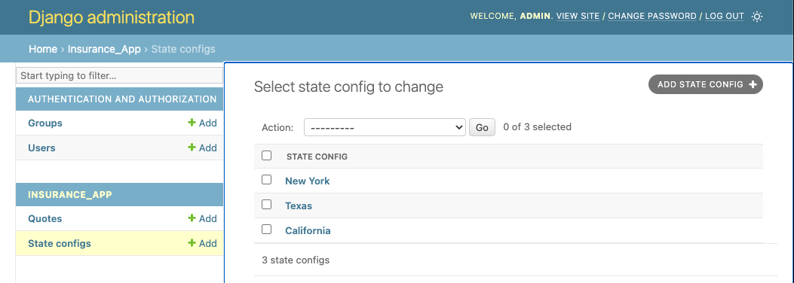
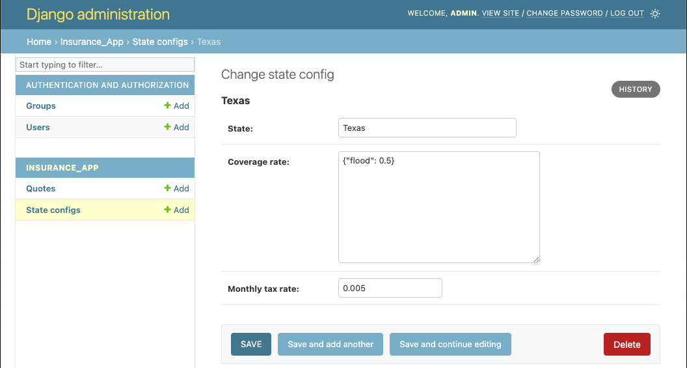
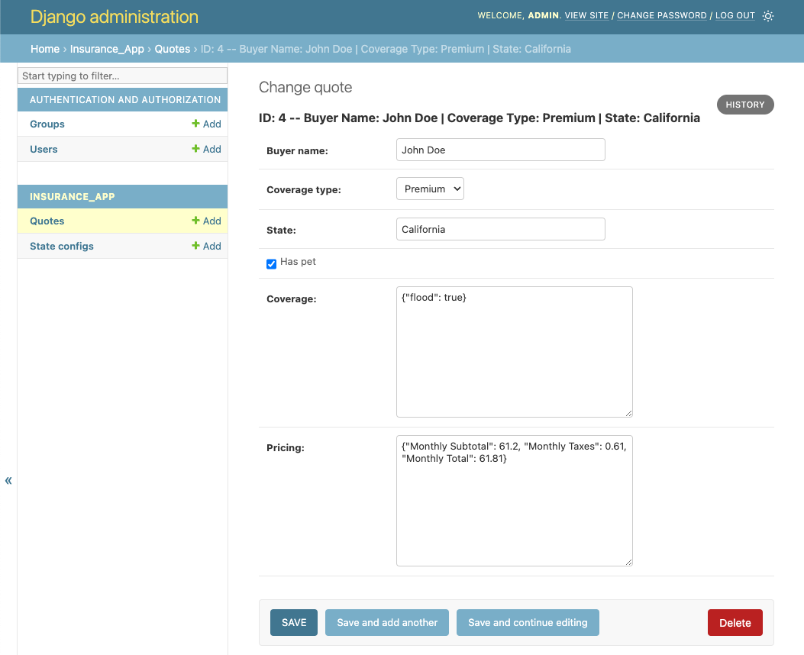

# Insurance Quote App
This is a Django application providing an API for managing insurance quotes.
https://sure.notion.site/2022-Backend-Take-Home-Prompt-5fd6c44daa55421081b144778e07ff68
...

## Getting Started

### Prerequisites
Python 3.12.0 is recommended. 
> Optional: 
If `asdf` is already installed then running `asdf install` shall install python 3.12.0 based on `.tool-versions`. However, this is not required but if still interested then refer to the [asdf documentation](https://asdf-vm.com/#/core-manage-asdf) for installation instructions 

This app uses Poetry for the virtual environment and dependency management.


1. **Install Poetry:**

    ```bash
    curl -sSL https://install.python-poetry.org | python3 -
    ```

    Or refer to the [official Poetry installation guide](https://python-poetry.org/docs/#installation) for other methods.
<br>

2. **Install Dependencies:**
    Inside this project folder, run the following

    ```bash
    poetry install
    ```

3. **Run Migrations:**

    ```bash
    poetry run python manage.py migrate
    ```

5. **Create Superuser:**

    ```bash
    poetry run python manage.py createsuperuser
    ```

6. **Run the Development Server:**

    ```bash
    poetry run python manage.py runserver
    ```

7. **Access the App:**

    Visit [http://127.0.0.1:8000/](http://127.0.0.1:8000/) It automatically redirects you to the Admin page.
<br>


## Usage
The three states are already populated with the configuration



### Submit Quote
```curl
 curl -X POST http://localhost:8000/insurance/quote/ -H "Content-Type: application/json" -d '{"buyer_name": "John Doe", "coverage_type": "Basic", "state": "California", "has_pet": true, "coverage": {"flood":true}}' 
 ```
 
### Get Quote
```
curl -X GET http://localhost:8000/insurance/quote/1/
```
This Returns the following
```JSON
{
  "id": 5,
  "buyer_name": "John Doe",
  "coverage_type": "Basic",
  "state": "California",
  "has_pet": true,
  "coverage": {
    "flood": true
  },
  "pricing": {
    "Monthly Subtotal": 40.8,
    "Monthly Taxes": 0.4,
    "Monthly Total": 41.2
  }
}
```

### Testing

**Run Unit Tests:**

```bash
poetry run python manage.py test
```
